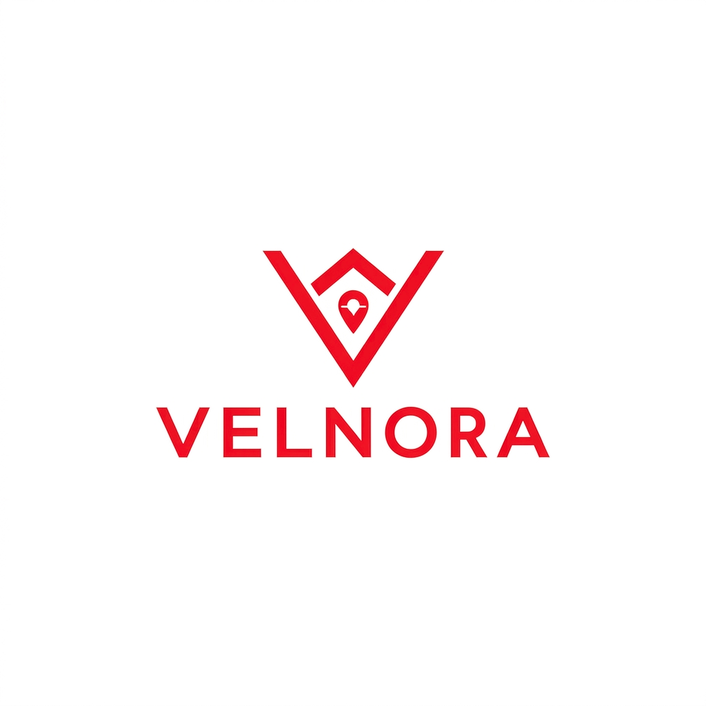
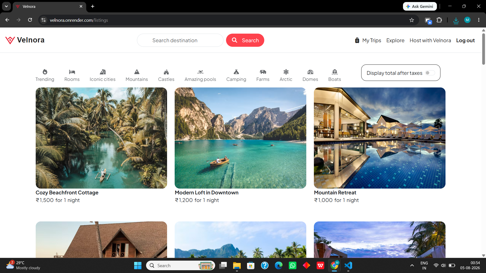
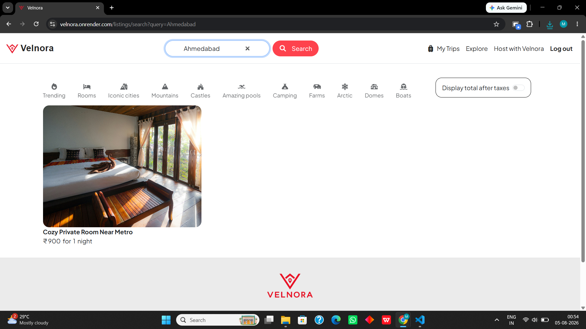
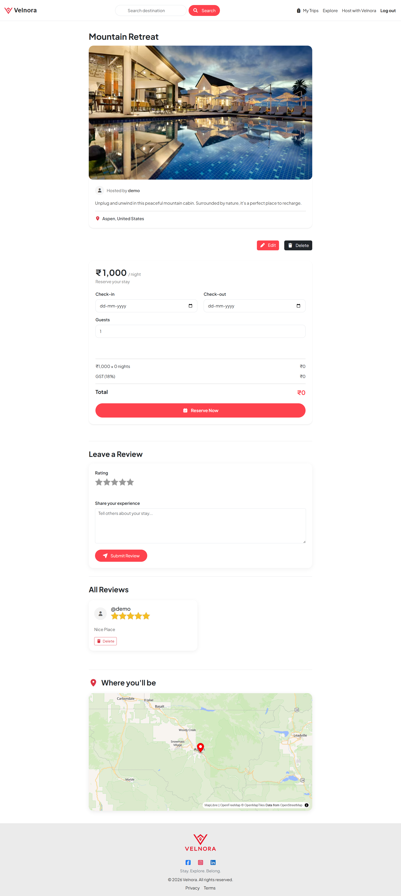
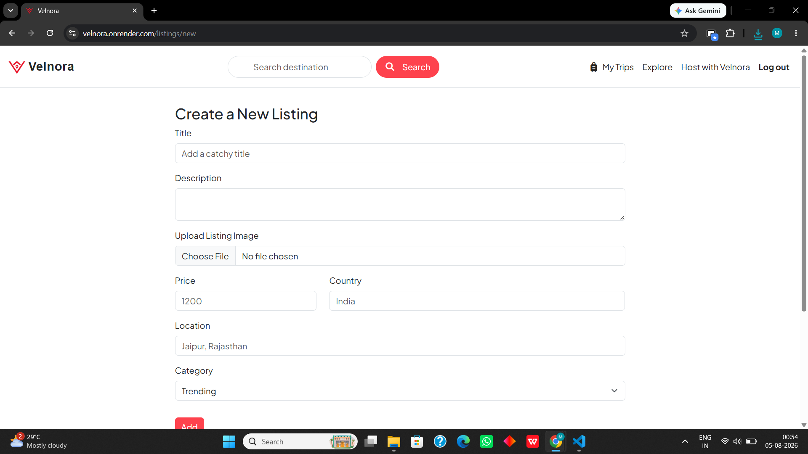
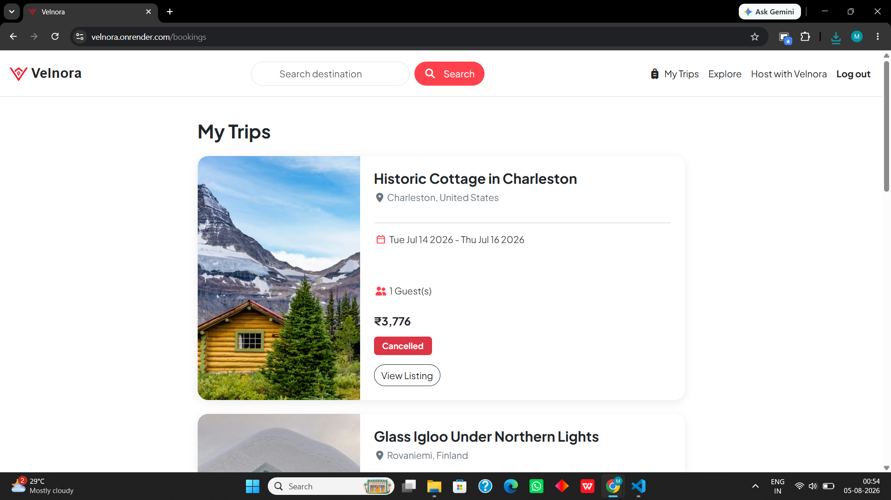
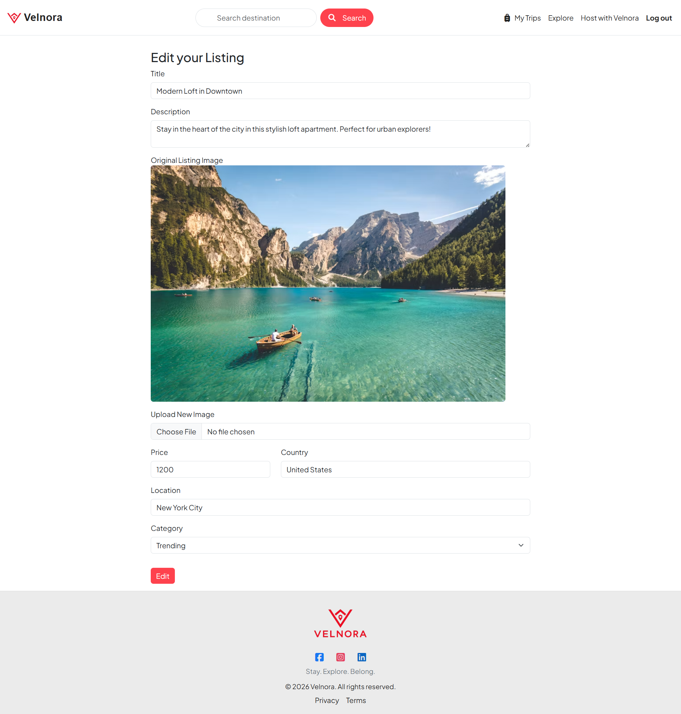
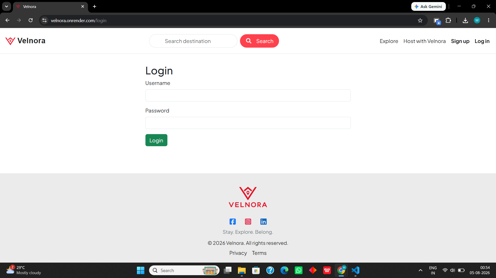
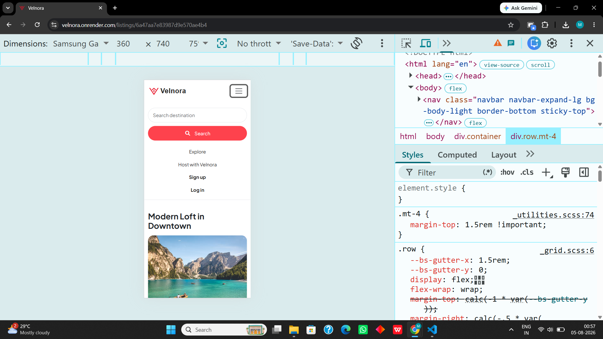
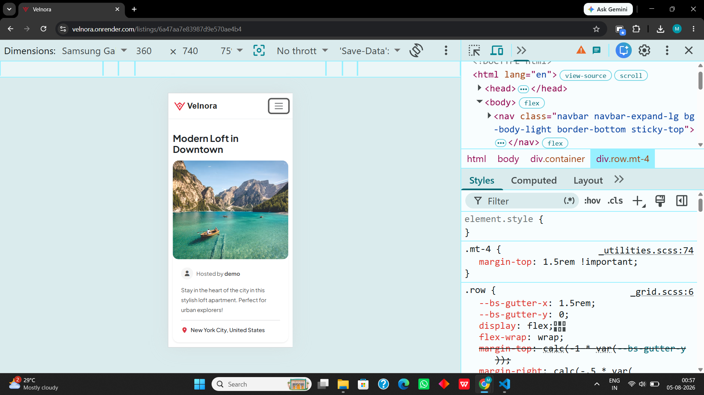

<div align="center">



# Velnora

### Full-Stack Vacation Rental & Property Booking Platform

A modern accommodation booking platform inspired by Airbnb, built with Node.js, Express.js, MongoDB, EJS, and Bootstrap.

**[🌐 Live Demo](https://velnora.onrender.com)**

</div>

---

# 📖 About

Velnora is a full-stack vacation rental platform that allows users to browse unique stays, create property listings, upload images, write reviews, and manage bookings through a clean and responsive interface.

The project was built to gain hands-on experience with full-stack web development, authentication, CRUD operations, image uploads, map integration, session management, validation, and deployment.

---

# ✨ Features

* 🔐 User Authentication — Register & Login
* 🏠 Create, Edit & Delete Property Listings
* 📸 Image Uploads with Cloudinary
* ⭐ Ratings & Reviews
* 📍 Interactive Maps using MapLibre
* 🔍 Destination Search
* 🏷️ Property Category Filters
* 🧳 My Trips Page
* 📱 Responsive Design
* 🛡️ Server-side Validation with Joi
* 🔒 Authentication & Authorization with Passport.js

---

# 📸 Screenshots

## 🏠 Home Page & Search

| Home Page                            | Search Results                                 |
| ------------------------------------ | ---------------------------------------------- |
|  |  |

## 🏡 Listing Details



## ➕ Add Listing & 🧳 My Trips

| Add Listing                              | My Trips                          |
| ---------------------------------------- | --------------------------------- |
|  |  |

## ✏️ Edit Listing



## 🔐 Login & 📱 Mobile

| Login Page                        | Mobile View                              |
| --------------------------------- | ---------------------------------------- |
|  |  |

## 📱 Mobile Responsive Design

| Home Page                                | Listing Details                               |
| ---------------------------------------- | --------------------------------------------- |
|  |  |

---

# 🛠️ Tech Stack

## Frontend

* HTML5
* CSS3
* Bootstrap 5
* JavaScript
* EJS

## Backend

* Node.js
* Express.js

## Database

* MongoDB Atlas
* Mongoose

## Authentication

* Passport.js
* Express Session

## Cloud Services

* Cloudinary
* MapLibre
* MongoDB Atlas

## Validation

* Joi

## Deployment

* Render

---

# 🏗️ Architecture

```text
User
  ↓
EJS / Bootstrap / JavaScript
  ↓
Express.js Routes
  ↓
Controllers & Middleware
  ↓
Mongoose
  ↓
MongoDB Atlas

External Services:
Cloudinary → Image Storage
MapLibre   → Interactive Maps
Render     → Deployment
```

---

# 📚 What I Learned

During the development of Velnora, I gained practical experience with:

* Building a complete MVC architecture
* RESTful routing
* CRUD operations
* Authentication & authorization
* Session management
* MongoDB data modeling
* Cloudinary image uploads
* Interactive maps
* Server-side validation
* Responsive web design
* Deploying Node.js applications on Render

---

# 🚀 Future Improvements

* 💳 Online Payment Integration
* ❤️ Wishlist
* 📅 Booking Calendar
* 📧 Email Notifications
* 👤 User Profile Dashboard
* 🛎️ Host Dashboard
* 📊 Admin Panel

---

# 🎥 Project Demo

A complete walkthrough of Velnora is available in the project demo.

**[▶️ Watch Project Demo](https://drive.google.com/file/d/1SIZGlFzeulXO-EmP4vUJDgAya-lymyJM/view?usp=sharing)**

---

# 🔐 Source Code

The complete source code and implementation of Velnora are maintained in a private repository.

**[📂 View Source Repository](https://github.com/mannpatel-08/velnora)**

The repository is private to protect the complete source code while this public repository serves as a portfolio showcase.

---

# 🙏 Inspiration

Velnora is inspired by Airbnb and was developed as an educational project to practice full-stack web development concepts.

The application was independently implemented using a custom codebase and Velnora branding.

---

# 👨‍💻 Author

**Mann Patel**

[GitHub](https://github.com/mannpatel-08)

---

© 2026 Mann Patel
